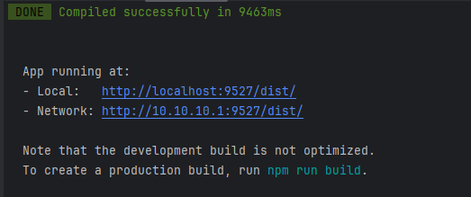

### 运行前端项目

- 首先git clone 本项目

```
git clone git@github.com:xiaohu913255/FrontGateway.git

```

- 确保本地环境安装了nodejs,注意node.js版本与node-sass依赖适配
- 需严格控制node.js版本

```
node -v
v11.15.0
```

- 安装依赖包和前端项目

#### 1、执行信息清除
```
rm -rf node_modules
npm cache clean --force
rm -rf package-lock.json
```
#### 2、设置npm加速
```
npm config set registry https://registry.npmmirror.com/
```

#### 3、git添加一个全局属性，防止无法下载等问题
```
git config --global url."https://".insteadOf git://
```

#### 4、安装node依赖包
```
npm install
npm install -g cnpm
cnpm install
```
#### 5、运行前端项目
```
npm run dev

```


